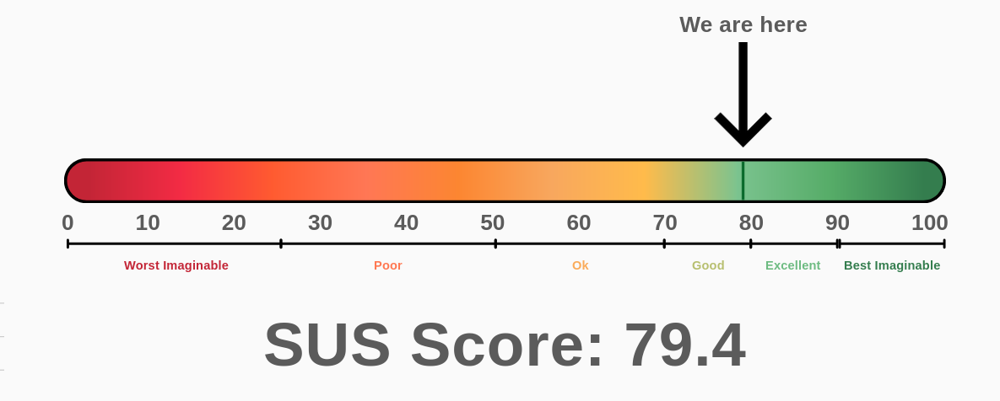
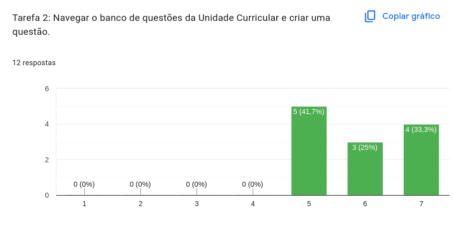

# Milestone 4

## Digital Accessibility and Usability

## Presentation

---

  <iframe
    loading="lazy"
    style={{
      position: 'absolute',
      width: '100%',
      height: '100%',
      top: 0,
      left: 0,
      border: 'none',
      padding: 0,
      margin: 0,
    }}
    src="https://www.canva.com/design/DAHD0U2UeAo/-dPOtJ9eHFc_Z5ihyZA9-g/view?embed"
    allowFullScreen
  ></iframe>

<a
  href="https://www.canva.com/design/DAHD0U2UeAo/-dPOtJ9eHFc_Z5ihyZA9-g/view?utm_content=DAHD0U2UeAo&utm_campaign=designshare&utm_medium=embeds&utm_source=link"
  target="_blank"
  rel="noopener"
>
  EduPro - MS4
</a>
---

## 1. Usability and Accessibility

In line with the development of our system and the required deliverables for this milestone, we conducted **accessibility tests** accompanied by **SUS (System Usability Scale) assessments**.  

Our usability tests included **12 users**. We focused on a diverse group of testers, even though our requirements assume that all users have a minimum level of software literacy. This diversity proved valuable, as it provided a wide range of opinions and feedback, covering aspects such as layout, sizing, and page guidance.

### 1.2 Founds

The overall experience for both the **Manager** and **Regent** user flows was positive, and tasks were completed with relative ease.  

**Observations:**

- Users were able to navigate the system efficiently.
- Key functionalities were intuitive and accessible.  
- Most tasks were completed without assistance.  

**Issues Noted:**

- Some complaints regarding the **UI size**, with elements feeling too small for example the breadcrumb and and logout button.  
- Certain **colors lacked sufficient contrast** against the white background, affecting readability specially the checkmark box in some cases.
- Some people felt lost afeter creating a topic and did not know where to go next.

**Data Summary:**  

- From the collected data, our calculated SUS score was 79.4

- Example from Usability Test (1 Very Hard -> )

## 2. Future Work

The main objectives for the next two sprints are focused on **system hardening** and completing the **evaluation cycle**:

### 2.1 Exam Assignment

- Implement the mechanism for assigning tests during exam sessions  
- Handle edge cases to prevent misassignment or conflicts  

### 2.2 Automatic Correction

- Develop automatic grading that **combines optical mark recognition (OMR)** with our solution
- Aggregate results to generate **final scores** for each exam
- Ensure integration with the **existing exam workflow**  
- Include validation checks to handle **misreads submissions**

### 2.3 Accessibility and Usability Improvements

- Address UI size and contrast issues identified in previous tests  
- Refine feedback messages to be more descriptive and clear