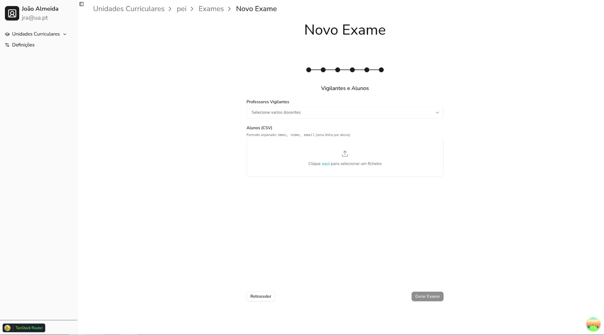

# Milestone 5

## Prototype

---

  <iframe loading="lazy" style={{ position: 'absolute', width: '100%', height: '100%', top: 0, left: 0, border: 'none', padding: 0, margin: 0 }} src="https://www.canva.com/design/DAHEa0FKQ0Q/yinpWcPfvTdGfayQwjX8sg/view?embed" allowFullScreen />

<a href="https://www.canva.com/design/DAHEa0FKQ0Q/yinpWcPfvTdGfayQwjX8sg/view?utm_content=DAHEa0FKQ0Q&utm_campaign=designshare&utm_medium=embeds&utm_source=link" target="_blank" rel="noopener">EduPro — MS5</a>

---

## 1. What Changed Since the Last MVP

Since the last MVP, our project has undergone several major improvements.

---

### 1.1 Keycloak Integration

The most significant architectural change was the full integration of Keycloak as our access management layer. This required a database refactoring effort: user models were migrated out of our own schema and into Keycloak, which became the source for all authentication and authorization.

This transition unlocked several key capabilities:

- **Role-Based Access Control (RBAC):** Permissions are now centrally defined and enforced, with distinct roles professors, regents and managers.
- **Custom permission scopes:** Fine-grained access control allows specific actions to be restricted at the resource level.
- **Frontend authentication lifecycle:** The frontend was overhauled to handle the full OAuth token flow — from acquiring tokens via Keycloak to attaching Bearer tokens through on every outgoing API request.

---

### 1.2 Production Deployment

EduPro is now live. The deployment involved a complete rework of our containerization strategy, centered around an Nginx reverse proxy that sits in front of the entire application stack. Key outcomes include:

- All services are isolated behind the proxy, with no direct external exposure.
- SSL termination is enforced at the proxy level, mandating HTTPS for all external traffic.

---

### 1.3 Exam Assignment Flow

We significantly extended the exam pipeline to support a fully guided assignment workflow. Previously, users were limited to manual test generation. The platform now supports end-to-end exam assignment, with the following flow:

1. **Configuration** — The exam creator defines the session parameters, designates exam vigilants, and performs bulk student enrollment via a standardized CSV upload.
2. **Waiting Room** — Once configured, a Waiting Room session is initialized, serving as the coordination hub for the exam.
3. **QR-based assignment** — During the exam, regents and authorized professors can assign physical test papers to students by scanning QR codes, linking each paper to a student in real time.

*The updated configuration interface, showing vigilant assignment and CSV for students.*

---

### 1.4 Mobile Experience

#### 1.4.1 Design Philosophy

The exam assignment were designed for mobile, reflecting how professors actually operate during an exam — moving between students, not at a desk.

#### 1.4.2 Progressive Web App (PWA)

The entire platform is delivered as a PWA. On mobile devices, access is scoped to the unit selection page, from which the app automatically redirects users to the appropriate view based on the current state of the Waiting Room.

---
